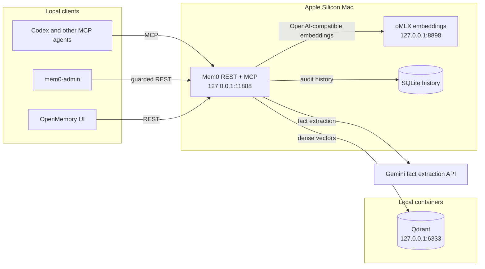

# mem0-local-runtime

Portable local Mem0 runtime for Apple Silicon macOS. It runs Mem0 and MCP on the
host, Qdrant and OpenMemory UI in containers, and oMLX as the local embedding
server.

The runtime currently pins the tested `mem0ai==2.0.19`. Upstream `2.0.20` is
intentionally deferred until the local seven-day package-age gate admits it.
Its `Makefile`, Ruff version,
line length, lint selection, import sorting, and test targets follow the
[upstream Mem0 Python project](https://github.com/mem0ai/mem0/blob/main/Makefile)
and its
[`pyproject.toml`](https://github.com/mem0ai/mem0/blob/main/pyproject.toml),
adapted from Hatch to this repository's existing `uv` workflow.

## Topology

| Component | Address | Runtime |
| --- | --- | --- |
| Mem0 REST and MCP | `127.0.0.1:11888`, MCP at `/mcp` | host Python via `uv` |
| Qdrant | `127.0.0.1:6333` | official container |
| OpenMemory UI | `127.0.0.1:11889` | official container |
| oMLX embeddings | `127.0.0.1:8898/v1` | host-native Apple Silicon |



The default memory namespace is `local-user`. Override it consistently with
`MEM0_DEFAULT_USER_ID`; it is a logical Mem0 scope, not authentication or an OS
account.

## 1. Preflight

```bash
sw_vers
uname -m
docker version
docker compose version
brew install uv jq
brew tap jundot/omlx https://github.com/jundot/omlx
brew install jundot/omlx/omlx
```

The launchd template and flags were checked with oMLX `0.6.4` installed by this
Homebrew formula. A differently installed binary may require changing its
absolute path in the local rendered plist.

The template intentionally passes `--no-cache`. oMLX paged SSD caching optimizes
repeated-prefix TTFT for generation LLMs; its embedding engine uses a single
forward pass and does not consume that causal KV cache. See the
[design rationale](../docs/design-rationale.md) before enabling a shared cache for
a separate local generation workload.

Stop if the machine is not Apple Silicon, required ports are occupied, or an
existing `~/.config/mem0` contains data that has not been reviewed.

## 2. Install runtime files

```bash
install_dir="$HOME/.config/mem0"
data_dir="$HOME/.local/share/mem0"

test ! -e "$install_dir"
mkdir -p "$install_dir" "$data_dir/qdrant/storage" \
  "$data_dir/qdrant/snapshots" "$HOME/.omlx/models" "$HOME/.omlx/logs"

rsync -a --exclude '.venv' --exclude '.env' --exclude 'config.json' \
  runtime/ "$install_dir/"
sed "s|__HOME__|$HOME|g" runtime/env.example > "$install_dir/.env"
chmod 600 "$install_dir/.env"
```

Run these commands from the repository root. The refusal check intentionally
prevents an existing installation from being overwritten.

## 3. Choose and download an embedding model

Two known profiles are documented. Qwen3 is the repository default; BGE-M3 is
the lower-footprint alternative used in the original local environment.

| Model | Dimensions | Context | Strengths | Tradeoffs |
| --- | ---: | ---: | --- | --- |
| [`Qwen3-Embedding-4B-4bit-DWQ`](https://huggingface.co/mlx-community/Qwen3-Embedding-4B-4bit-DWQ) | 2560 | 32K | Instruction-aware, 100+ natural and programming languages, strong multilingual and code retrieval | Larger model and vectors; local latency is not benchmarked here |
| [`bge-m3-mlx-fp16`](https://huggingface.co/mlx-community/bge-m3-mlx-fp16) | 1024 | 8K | Smaller vectors; the upstream model supports multilingual dense, sparse, and multi-vector retrieval | Shorter context; this stack currently uses only its dense-vector output |

The upstream Qwen3 model card reports higher aggregate multilingual MTEB scores
for Qwen3-Embedding-4B than for BGE-M3. Those numbers do not benchmark these
community MLX conversions, this Mem0 workload, or this Mac. Qwen3 is therefore an
opinionated quality-first default, not a universal winner. BGE-M3 is the
footprint-oriented option because it uses smaller vectors and a smaller model;
measure local latency and retrieval quality before drawing stronger conclusions.

Both choices fill the dense-embedding role; neither replaces Mem0's NLP path.
This runtime installs `mem0ai[nlp]`, so the pinned Mem0 release uses spaCy's
English model for entity extraction and keyword lemmatization. With Qdrant, actual
BM25 scoring additionally requires `fastembed`, which this minimal dependency set
does not install. The default path therefore retains entity extraction and
cross-lingual dense retrieval but does not claim full BM25 hybrid search. Selecting
BGE-M3 also does not activate its sparse or ColBERT-style modes because oMLX
returns only the OpenAI-compatible dense embedding. See the
[retrieval-layer rationale](../docs/design-rationale.md#retrieval-layers-and-language-boundary).

Qwen3 profile:

```bash
uvx hf download mlx-community/Qwen3-Embedding-4B-4bit-DWQ \
  --local-dir "$HOME/.omlx/models/Qwen3-Embedding-4B-4bit-DWQ"
```

BGE-M3 profile:

```bash
uvx hf download mlx-community/bge-m3-mlx-fp16 \
  --local-dir "$HOME/.omlx/models/bge-m3-mlx-fp16"
```

The upstream references are the
[Qwen3 Embedding model card](https://huggingface.co/Qwen/Qwen3-Embedding-4B),
[BGE-M3 model card](https://huggingface.co/BAAI/bge-m3), and the
[BGE-M3 paper](https://arxiv.org/abs/2402.03216).

Do not switch an existing Qdrant collection between these profiles. Their vector
dimensions differ, so changing models requires a new collection and re-embedding
the source memories.

## 4. Create local configuration

Copy the Qwen3 default configuration, or select the BGE-M3 variant, and edit only
the local files:

```bash
cd "$HOME/.config/mem0"
# Qwen3 default:
cp config.example.json config.json
# BGE-M3 alternative instead:
# cp config.bge-m3.example.json config.json
jq --arg history "$HOME/.local/share/mem0/history.db" \
   '.history_db_path = $history' config.json > config.json.tmp
mv config.json.tmp config.json
chmod 600 config.json .env
$EDITOR .env
uv sync
```

Set `GOOGLE_API_KEY` in `.env`. Do not put the key under `llm.config`; in
Mem0 2.0.19 an explicit config value takes precedence over the environment.
The direct `google-genai` dependency is required by this default provider.

`uv run python server.py` still starts Uvicorn in-process through
`uvicorn.run(...)`. This entrypoint centralizes `.env`, host, and port handling;
it does not remove the Uvicorn dependency.
Never commit or upload the populated `.env` or rendered configuration.

For Gemini, OpenAI, Ollama, and OpenAI-compatible examples—with explicit
verification status—read [`docs/llm-providers.md`](../docs/llm-providers.md).
General defaults and precedence are documented in
[`docs/configuration.md`](../docs/configuration.md).

## 5. Start and verify

Install the loopback-only oMLX job:

```bash
mkdir -p "$HOME/Library/LaunchAgents"
sed "s|__HOME__|$HOME|g" launchd/local.omlx-mem0.plist.template \
  > "$HOME/Library/LaunchAgents/local.omlx-mem0.plist"
plutil -lint "$HOME/Library/LaunchAgents/local.omlx-mem0.plist"
launchctl bootstrap "gui/$UID" "$HOME/Library/LaunchAgents/local.omlx-mem0.plist"
launchctl kickstart -k "gui/$UID/local.omlx-mem0"
```

Then validate the full stack in the foreground:

```bash
cd "$HOME/.config/mem0"
./run.sh
```

From another terminal:

```bash
curl -fsS http://127.0.0.1:11888/health | jq .
curl -fsS http://127.0.0.1:6333/healthz
curl -fsSI http://127.0.0.1:11889 | head
```

After foreground validation, stop it with Ctrl-C and install the Mem0 job:

```bash
sed "s|__HOME__|$HOME|g" launchd/local.mem0-server.plist.template \
  > "$HOME/Library/LaunchAgents/local.mem0-server.plist"
plutil -lint "$HOME/Library/LaunchAgents/local.mem0-server.plist"
launchctl bootstrap "gui/$UID" "$HOME/Library/LaunchAgents/local.mem0-server.plist"
launchctl kickstart -k "gui/$UID/local.mem0-server"
curl -fsS http://127.0.0.1:11888/health | jq .
```

Both templates contain `__HOME__` placeholders and bind services to loopback.

## Commands

Add `runtime/bin` to `PATH`, or copy its commands to a personal bin directory:

```text
mem0-ctl       start, stop, status, health, logs, search
mem0-admin     context, review, forget, bounded Dream cleanup
mem0-backup    capture, verify, publish, restore, rotate, status
```

`mem0-ctl agents configure` connects installed Codex, Claude Code, OpenCode,
AGY, and Hermes clients through their native MCP commands. Hermes setup pauses
for its native authentication and tool-selection prompts. Direct MCP calls
remain model-selected, so
`mem0-ctl codex-hooks install` is the recommended Codex baseline for dependable
prompt retrieval and response capture. Read the
[agent integration guide](../docs/agent-integration.md) before trusting the hooks
or copying the optional administration skill.

Remote backup is disabled until `MEM0_BACKUP_REMOTE` is configured. For the
meaning and safety model of the `dream` subcommand, read
[`docs/dream.md`](../docs/dream.md).

Restore one exact generation only after reviewing its name:

```bash
mem0-backup restore 'mem0-2026-09-07T03:00:00+00:00' --yes
```

The command verifies the generation, captures a separate rollback generation,
stops the API during both-store replacement, and verifies Qdrant plus SQLite
before restarting. If mutation starts but restore fails, an in-progress marker
keeps the API unavailable until the recorded rollback generation is restored.
Read the complete operator procedure and version constraints in
[`docs/restore.md`](../docs/restore.md).

MCP exposes guarded single-item deletion. Its user-facing instructions require the
agent to show the exact memory and ask for approval; the server itself enforces
the reviewed hash/revision/scope and automatically captures a verified backup.
An agent-supplied approval boolean is deliberately not treated as a security
control. Bulk deletion is not exposed. The legacy-compatible REST delete route
returns `403` unless `MEM0_ALLOW_UNGUARDED_DELETE=true`; `mem0-admin` remains the
fuller review workflow.

`mem0-backup restore` is an operator-invoked recovery mechanism, not authorization
for unattended cleanup. The project still ships no isolated recovery drill.
Dream therefore remains human-approved and unscheduled.

## Tests (from a cloned repository)

```bash
make -C runtime all
```
